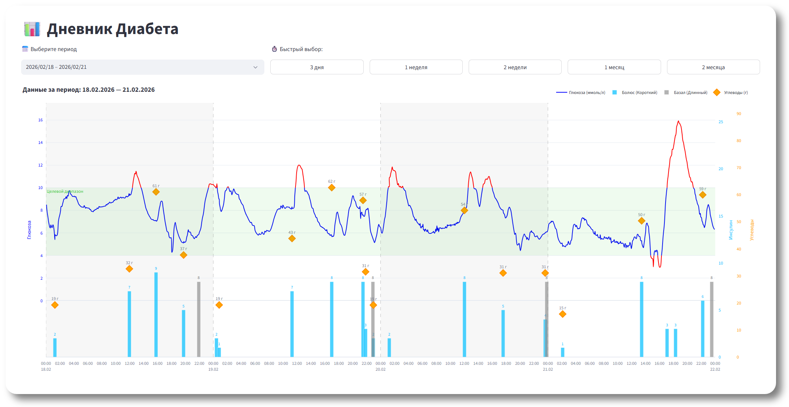

# Healthkit Diabetes

Streamlit-приложение на Python для визуализации данных о диабете из Apple Health.

Парсит XML-экспорт → извлекает глюкозу/инсулин/углеводы → формирует интерактивный отчет-график за выбранный период.

**Стек:** Python 3.10+ · Streamlit · Plotly · pandas



---

## Возможности

- 📦 Парсинг Apple Health export (`Record` в XML) потоково через `iterparse`
- 🩸 Извлекаемые метрики:
  - **Глюкоза** — `HKQuantityTypeIdentifierBloodGlucose`
  - **Углеводы** — `HKQuantityTypeIdentifierDietaryCarbohydrates`
  - **Инсулин** — `HKQuantityTypeIdentifierInsulinDelivery`
    - авто-разделение на **Базал/Болюс** по `HKInsulinDeliveryReason`
- 📅 Выбор периода + быстрые пресеты: **3 дня / 1 неделя / 2 недели / 1 месяц / 2 месяца**
- 📊 Интерактивный график (Plotly):
  - глюкоза — сглаженная линия с цветовым кодированием: **синяя** (в целевом диапазоне) / **красная** (вне диапазона) + подсветка целевого диапазона
  - инсулин — столбики (болюс/базал) с подписью значений
  - углеводы — маркеры с подписью "<N> г"
  - разделители дней: чередующийся фон + пунктирные линии
  - динамические метки на оси времени: 2 ч / 6 ч / 12 ч / 24 ч / 7 дней — в зависимости от выбранного диапазона
- 🖼️ Экспорт графика в PNG (кнопка в Plotly toolbar)

---

## Данные Apple Health

Приложение ожидает файл `export.xml` **в корне проекта**.

> Apple упаковывает данные в ZIP-архив, внутри которого лежит `apple_health_export/export.xml`.
> Просто скопируй его в корень проекта.

---

## Запуск — через Makefile

Makefile заточен под Windows: venv создаётся в папке `env/`.

```bash
make install
make run
```

После `make run` откроется браузер на `http://localhost:8501`.

Очистка окружения:

```bash
make clean
```

> **Нужен `make`?** Windows: Git Bash / MSYS2 / WSL / Chocolatey / Scoop — любой вариант подойдёт.

---

## Приватность и безопасность

⚠️ `export.xml` содержит персональные медицинские данные — не коммить его в репозиторий.

---

## License

MIT — см. файл [LICENSE](LICENSE).
